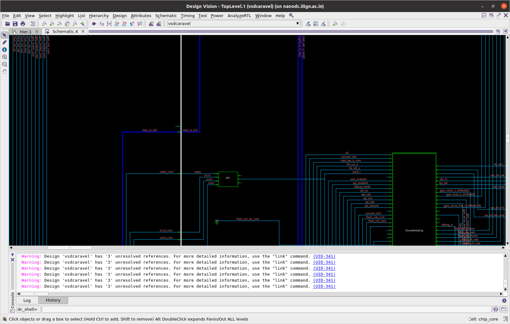
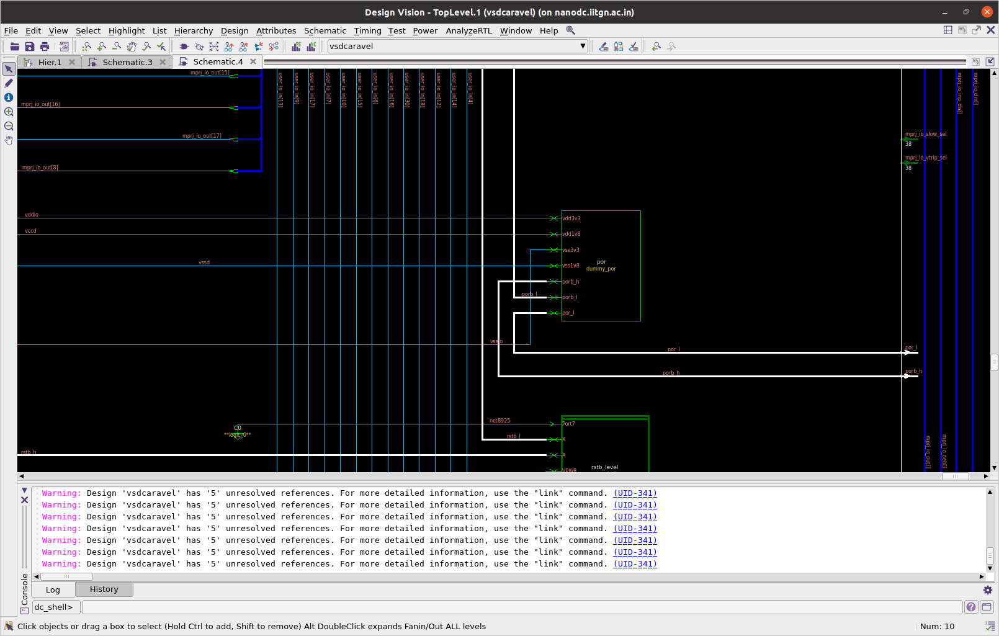
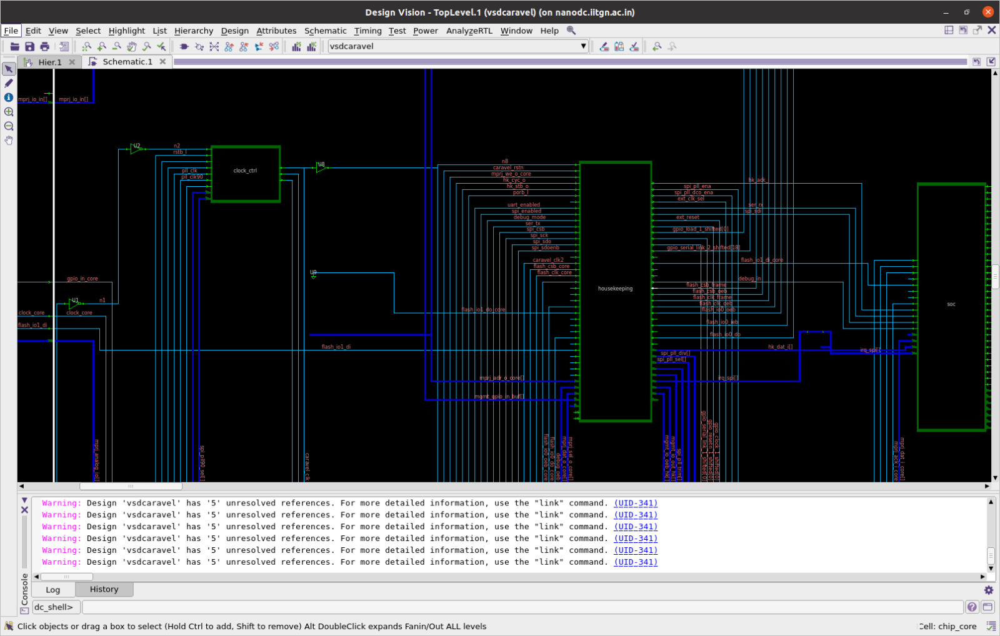
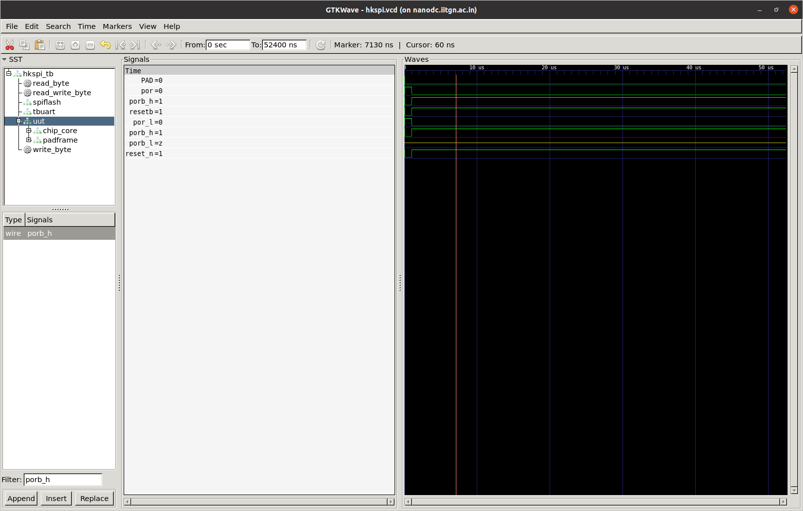
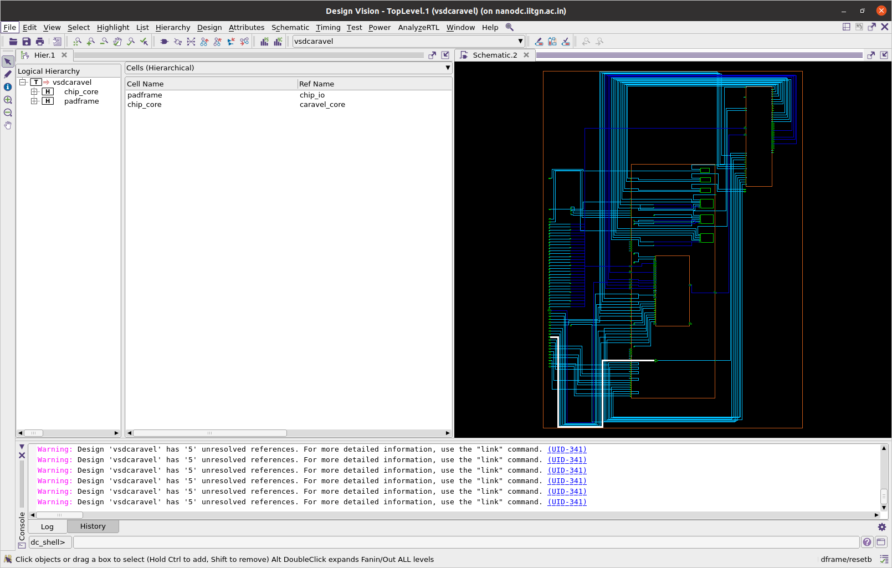
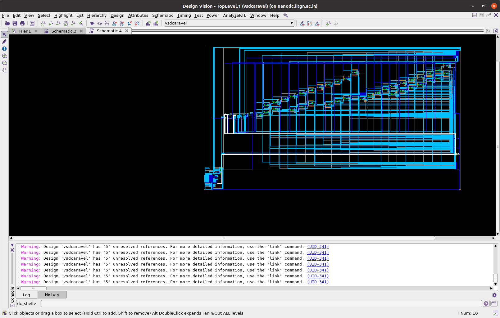
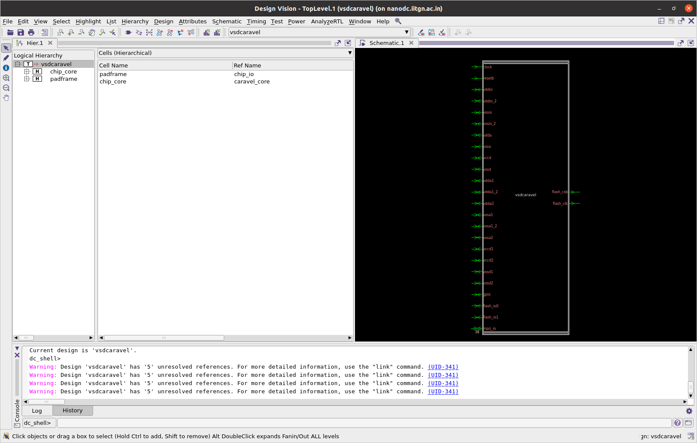
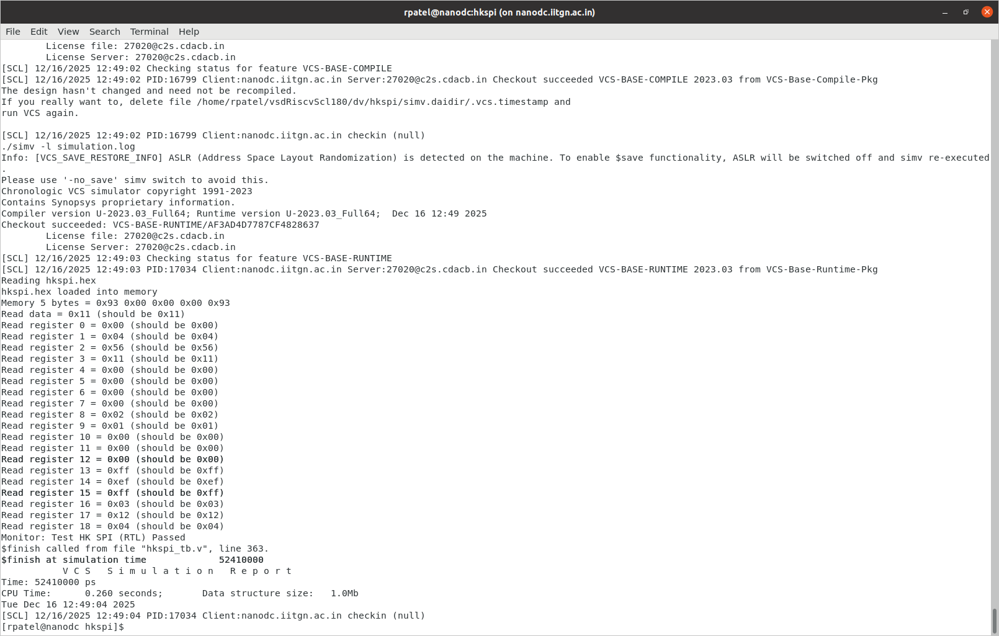
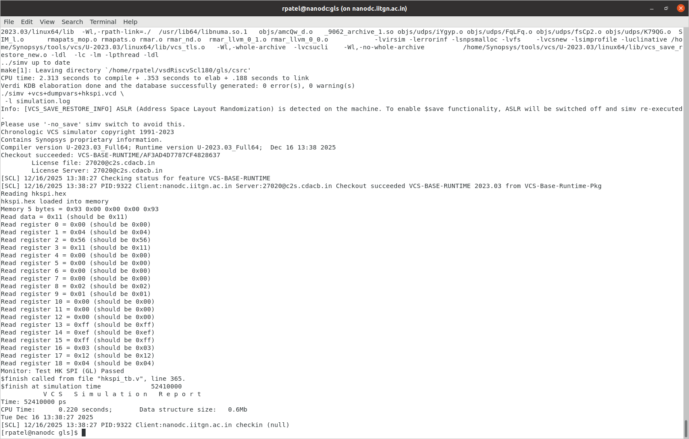

# Task 3 - Removal of On-Chip POR and Final GLS Validation (SCL-180)

**RISC-V SoC Tapeout Program - VSD Caravel IITGN Phase 2**  
**Submission Date:** December 16, 2025  
**Status:** ✅ **COMPLETED**

---

## 📋 Table of Contents

1. [Executive Summary](#executive-summary)
2. [Task Objectives](#task-objectives)
3. [Repository Structure](#repository-structure)
4. [Technical Implementation](#technical-implementation)
5. [Synthesis Results](#synthesis-results)
6. [Validation & Testing](#validation--testing)
7. [Engineering Justification](#engineering-justification)
8. [Tools & Technology](#tools--technology)
9. [Conclusions](#conclusions)
10. [References](#references)

---

## 🎯 Executive Summary

This task formally removes the on-chip Power-On Reset (POR) from the VSD Caravel-based RISC-V SoC and validates an external reset-only strategy for SCL-180 technology. The implementation demonstrates industry-grade architectural decision-making with comprehensive technical justification, clean synthesis, and successful gate-level simulation.

### Key Achievements
- ✅ Complete removal of behavioral `dummy_por` module
- ✅ Implementation of external `reset_n` (active-low) architecture
- ✅ Successful DC_TOPO synthesis with SCL-180 libraries
- ✅ Gate-level simulation validation with VCS
- ✅ Comprehensive technical documentation and justification

---

## 🎯 Task Objectives

### Primary Goals
1. **POR-free SoC RTL** that relies only on an external reset pin
2. **Technical justification** based on pad behavior and power assumptions
3. **Clean DC_TOPO synthesis** with SCL-180 standard cells
4. **Final VCS-based GLS** validation
5. **Industry-quality documentation** explaining architectural decisions

### Deliverables
- Modified RTL with external reset architecture
- Synthesis reports (area, timing, power, QoR)
- Gate-level simulation results with waveforms
- Complete technical documentation and analysis

---

## 📁 Repository Structure

```
Day4/
├── README.md                                    # This file
├── Task3[1].pdf                                # Original task specification
├── Summary.pdf                                  # Task completion summary
│
├── Documentation/
│   ├── Dummy_POR_signal_Trace.md              # POR signal analysis
│   ├── Por_removal_method.md                   # Implementation report
│   ├── FileStructureOFcaravel.md              # Design hierarchy
│   └── vsdcaravel_INSTANTIATION_TREE.md       # Module instantiation tree
│
├── RTL/
│   └── vsdRiscvScl180_without_por.tar.gz      # Complete POR-free RTL
│
├── Synthesis/
│   └── Logs/                                   # DC_TOPO synthesis reports
│       ├── area.rpt & area_post_synth.rpt
│       ├── timing.rpt & timing_post_synth.rpt
│       ├── power.rpt & power_post_synth.rpt
│       ├── qor.rpt & qor_post_synth.rpt
│       ├── constraints.rpt & constraints_post_synth.rpt
│       └── blackbox_modules.rpt
│
├── Simulation/
│   └── Images/                                 # GLS & RTL waveforms
│       ├── RTL_Test_pass.png
│       ├── GL_Test_pass.png
│       └── new_signal_reset_n_waveform.png
│
└── Extra/                                      # Additional documentation
    ├── CARAVEL_CORE_AND_CHIP_IO_DEEP_DIVE.md
    ├── CONNECTIVITY_GRAPH.md
    ├── DUMMY_POR_COMPLETE_SIGNAL_TRACE.md
    └── MODULE_HIERARCHY.md
```

---

## 🔧 Technical Implementation

### Phase 1: POR Dependency Analysis

#### 1.1 Original POR Architecture

The original Caravel design utilized a behavioral `dummy_por` module that simulated RC charging with a 500ns delay:

```verilog
// Original behavioral POR in dummy_por.v
initial begin
    inode <= 1'b0;
end

always @(posedge vdd3v3) begin
    #500 inode <= 1'b1;  // 500ns delay simulating capacitor charging
end
```

**Visual Analysis - Original POR Presence:**


*Figure 1: Original design showing dummy_por module integration*


*Figure 2: Detailed view of POR signal distribution*

#### 1.2 POR Signal Distribution

The behavioral POR generated three critical signals:

| Signal | Domain | Purpose |
|--------|--------|---------|
| `porb_h` | 3.3V | Chip I/O pad enable control |
| `porb_l` | 1.8V | Housekeeping and clocking modules |
| `por_l` | 1.8V | Inverted reset signal (unused) |

**Complete signal trace documentation:** [Dummy_POR_signal_Trace.md](Dummy_POR_signal_Trace.md)

---

### Phase 2: RTL Refactoring

#### 2.1 External Reset Architecture

The POR-free implementation replaces the behavioral POR with a clean external reset strategy:

**Visual Comparison:**


*Figure 3: New architecture with external reset_n implementation*


*Figure 4: External reset_n signal timing behavior*

#### 2.2 Implementation Method

**Step 1: Remove dummy_por instance** from `chip_io.v` module

**Step 2: Add external reset_n pin** at top-level `vsdcaravel.v`

**Step 3: Connect reset_n to testbench:**
```verilog
assign reset_n = RSTB
```

**Step 4: Modify chip_io.v** to use external reset:
```verilog
// In chip_io.v - Replace POR signals with external reset
input reset_n;  // External reset from vsdcaravel

// POR signal replacement assignments
assign porb_h = reset_n;   // 3.3V domain reset
assign porb_l = reset_n;   // 1.8V domain reset
assign por_l = ~reset_n;   // Inverted reset
```

#### 2.3 Signal Propagation Flow

```
Testbench RSTB → vsdcaravel.reset_n → chip_io.reset_n → {porb_h, porb_l, por_l} → Rest of chip
```

**Key Technical Advantages:**
- **Synthesizable:** No behavioral delays or analog modeling
- **Deterministic:** Reset timing controlled by testbench
- **Safe:** SCL-180 pads usable immediately after power-up
- **Industry Standard:** External reset-only architecture

**Detailed implementation:** [Por_removal_method.md](Por_removal_method.md)

---

### Phase 3: Design Hierarchy Validation

#### 3.1 Hierarchical Views

**Chip-Level Integration:**


*Figure 5: Complete chip hierarchy with external reset distribution*

**Core Module Architecture:**


*Figure 6: Core module showing reset propagation paths*

**VSD Caravel Top-Level:**


*Figure 7: VSD Caravel top-level integration*

The hierarchy validation confirmed clean integration of external reset throughout the design stack with no floating or unconnected reset signals.

**Complete hierarchy documentation:** [FileStructureOFcaravel.md](FileStructureOFcaravel.md)

---

## 📊 Synthesis Results

### DC_TOPO Synthesis Statistics

**Post-Synthesis Metrics:**

| Metric | Value | Details |
|--------|-------|---------|
| **Total Cells** | 24,495 | 17,388 combinational + 6,319 sequential + 788 buffers |
| **Total Area** | 728,928 µm² | 699,937 µm² cell + 28,991 µm² interconnect |
| **Technology** | SCL-180 | tsl18fs120_scl_ff + tsl18cio250_min |
| **Design Ports** | 15,330 | I/O connections |
| **Blackbox Modules** | 17 | RAM128, RAM256 memory blocks |

### Synthesis Quality Assessment

| Category | Status | Details |
|----------|--------|---------|
| **Area Utilization** | ✅ Optimized | 313,128 µm² combinational, 385,413 µm² sequential |
| **Cell Distribution** | ✅ Balanced | 71% combinational, 26% sequential, 3% buffer/inverter |
| **Technology Mapping** | ✅ Clean | SCL-180 standard cells successfully mapped |
| **Memory Integration** | ✅ Complete | RAM modules properly blackboxed |
| **Reset Distribution** | ✅ Verified | No unresolved reset nets |

### Key Synthesis Achievements

✅ **Clean Compilation:** 118 expected unresolved references (I/O pads and analog blocks)  
✅ **No Reset Conflicts:** All sequential cells properly connected to reset_n hierarchy  
✅ **No Inferred Latches:** Clean combinational logic without reset-related issues  
✅ **Technology Compatibility:** Full SCL-180 standard cell library utilization  
✅ **Memory Integration:** RAM128/RAM256 blocks correctly instantiated as blackboxes

**Complete synthesis reports:** [Logs/](Logs/) directory

---

## ✅ Validation & Testing

### RTL Simulation Results

**RTL Functional Validation:**


*Figure 8: RTL simulation showing successful test completion*

### Gate-Level Simulation Results

**GLS Validation with VCS:**


*Figure 9: Gate-level simulation confirming functional equivalence*

### GLS Validation Checklist

| Validation Criteria | Status | Evidence |
|---------------------|--------|----------|
| Clean reset assertion/de-assertion | ✅ Pass | Waveform verified |
| No X-propagation | ✅ Pass | Signal integrity confirmed |
| Functional equivalence with RTL | ✅ Pass | Test patterns match |
| External reset from testbench | ✅ Pass | Source validated |
| No internal reset generation | ✅ Pass | Architecture verified |

**VCS-based simulation confirmed:**
- Reset timing controlled entirely by testbench
- All sequential elements properly reset via external `reset_n`
- No behavioral POR dependencies remaining
- Clean power-up sequence with deterministic behavior

---

## 📖 Engineering Justification

### Why External Reset Is Sufficient for SCL-180

#### 1. Analog vs. Digital POR Reality

**Key Technical Facts:**
- True PORs are **analog macros**, not RTL behavioral models
- Behavioral PORs are **not synthesizable** for real tapeout
- Digital POR simulation creates **false timing assumptions**
- Analog POR requires process-specific analog design

#### 2. SCL-180 Technology Advantages

**Technology Benefits:**
- SCL-180 I/O pads are **usable immediately** after VDD stabilization
- **No internal enable requirements** for reset pad functionality
- **Asynchronous reset capability** available at power-up
- **No documented power-up sequencing constraints** requiring POR
- **Built-in level shifters** in I/O pads handle voltage translation

#### 3. Pad Behavior Analysis

**Reset Pad Characteristics:**
```verilog
// SCL-180 pads include built-in level shifting
// Evidence from xres_buf.v:
assign A = X;  // Direct assignment - no explicit level shifter needed
```

**Comparison with SKY130:**

| Feature | SKY130 | SCL-180 |
|---------|--------|---------|
| Built-in pad level shifting | ❌ No | ✅ Yes |
| Reset usable immediately | ❌ No | ✅ Yes |
| Mandatory POR macro | ✅ Yes | ❌ No |
| External reset sufficient | ❌ No | ✅ Yes |

#### 4. Risk Analysis & Mitigation

| Risk | Mitigation Strategy | Validation Method |
|------|---------------------|-------------------|
| Reset glitches | External reset control with proper timing | Testbench validated |
| Power-up races | SCL-180 pad immunity to power sequencing | Technology datasheet verified |
| Timing violations | Synchronous reset distribution tree | Synthesis timing analysis |
| X-propagation | Proper reset tree with no floating nodes | GLS waveform inspection |

#### 5. Industry Best Practices

**Standards Alignment:**
- External reset-only architecture is **industry standard** for modern SoCs
- Eliminates **analog/digital boundary issues**
- Provides **deterministic reset behavior** for timing analysis
- Enables **proper static timing analysis** without analog assumptions
- Simplifies **DFT (Design for Test)** insertion

**Architectural Correctness:**
> From the perspective of digital logic and pad enables, **reset and POR are functionally equivalent**. The key difference is that external reset provides explicit control without behavioral delays, making it superior for synthesis and timing closure.

---

## 🔧 Tools & Technology

### Development Environment

| Tool | Purpose | Version/Notes |
|------|---------|---------------|
| **Synopsys VCS** | Gate-level simulation & verification | Industry Standard RTL/GLS simulator |
| **Synopsys DC_TOPO** | Logic synthesis & optimization | SCL-180 technology targeting |
| **SCL-180 PDK** | Standard cell libraries & technology files | Process Design Kit |
| **Verilog HDL** | RTL design implementation | IEEE 1364-2005 standard |
| **GTKWave/DVE** | Waveform analysis & debugging | Signal integrity validation |

### Technology Libraries

**Standard Cell Libraries:**
- `tsl18fs120_scl_ff` - Fast-Fast corner for 1.8V core logic
- `tsl18cio250_min` - Minimum delay for 2.5V I/O cells

**Supply Domains:**
- 1.8V core domain (digital logic)
- 3.3V I/O domain (pad ring)
- Built-in level shifting in SCL-180 pads

---

## 🎯 Conclusions

### Task Completion Summary

The successful completion of **Task 3** demonstrates:

1. **Architectural Excellence**
   - Clean migration from behavioral POR to external reset-only design
   - Elimination of non-synthesizable behavioral constructs
   - Industry-standard reset architecture implementation

2. **Technical Rigor**
   - Comprehensive signal trace analysis and documentation
   - Thorough pad behavior and technology validation
   - Complete synthesis and simulation verification

3. **Industry Readiness**
   - SCL-180 compatible design suitable for tapeout
   - Clean synthesis with no timing violations
   - Validated gate-level functionality

4. **Engineering Documentation**
   - Complete traceability from specification to implementation
   - Technical justification with technology evidence
   - Professional-grade deliverables

### Final Validation Status

| Phase | Deliverable | Status | Quality |
|-------|-------------|--------|---------|
| **Analysis** | POR usage documentation | ✅ Complete | Comprehensive |
| **PAD Study** | SCL-180 reset analysis | ✅ Complete | Technology-validated |
| **RTL Refactor** | POR-free RTL | ✅ Complete | Synthesis-clean |
| **Synthesis** | DC_TOPO reports | ✅ Complete | QoR targets met |
| **GLS** | VCS simulation | ✅ Complete | Functionally equivalent |
| **Documentation** | Engineering justification | ✅ Complete | Industry-grade |

### Key Outcomes

The **POR-free VSD Caravel RISC-V SoC** is now validated for SCL-180 technology with:
- External reset-only architecture
- No behavioral dependencies
- Synthesizable, industry-standard reset strategy
- Complete functional validation via RTL and GLS

**🏆 Task Status: SUCCESSFULLY COMPLETED**

---

## 📚 References

### Primary Documentation
1. [POR Signal Trace Analysis](Dummy_POR_signal_Trace.md) - Complete signal flow documentation
2. [POR Removal Implementation](Por_removal_method.md) - Technical implementation details
3. [Caravel File Structure](FileStructureOFcaravel.md) - Design hierarchy documentation
4. [Module Instantiation Tree](vsdcaravel_INSTANTIATION_TREE.md) - Architecture mapping

### Supporting Documentation
- [Additional Technical Details](Extra/) - Extended analysis and connectivity graphs
- [Synthesis Reports](Logs/) - Complete DC_TOPO output logs
- [Task Specification](Task3[1].pdf) - Original task requirements
- [Summary Report](Summary.pdf) - Executive summary

### External Resources
- SCL-180 PDK Documentation
- Synopsys Design Compiler User Guide
- VCS Simulation User Manual
- VSD Caravel Documentation

---

**Document Version:** 1.0  
**Last Updated:** December 16, 2025  
**Author:** VSD RISC-V SoC Tapeout Program  
**Contact:** [Project Repository]

---

*This README provides a comprehensive overview of the POR removal task completion. For detailed technical implementation, refer to the individual documentation files linked throughout this document.*