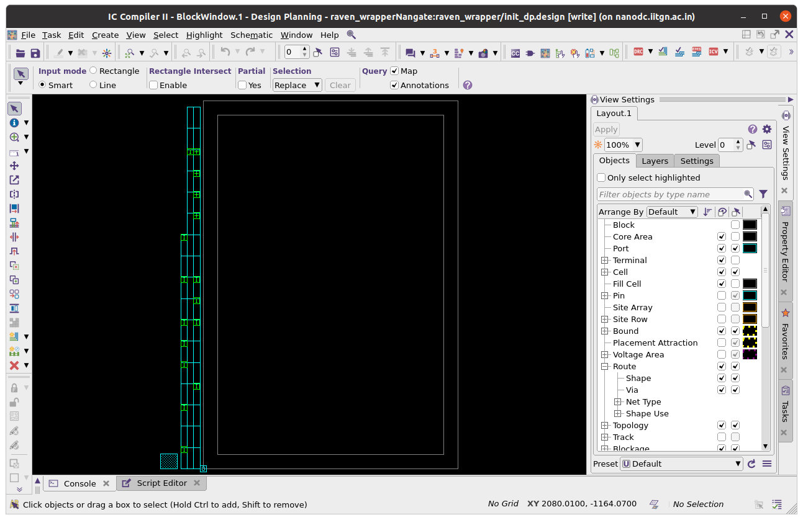
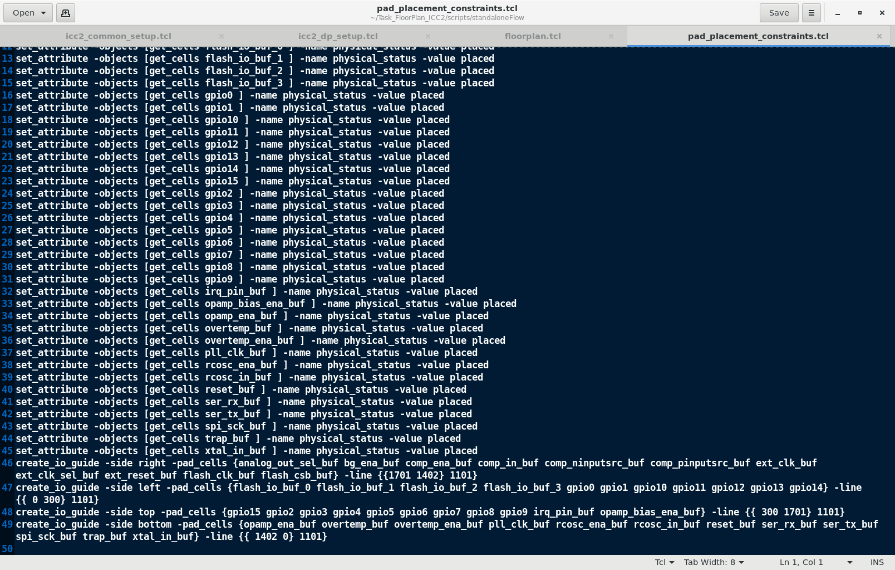
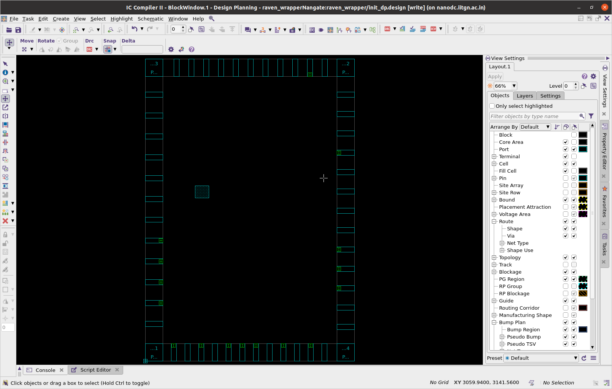

# Task 5: SoC Floorplanning Using ICC2 - Complete Learning Guide

## Introduction to ICC2 Tool
**Synopsys IC Compiler II (ICC2)** is a comprehensive place-and-route tool used in digital IC backend design. It handles the physical implementation of digital designs from netlist to final layout.

### What is Physical Design?
Physical design is the process of transforming a synthesized netlist into a physical layout that can be manufactured. The main stages are:
1. **Floorplanning** - Defining die size, core area, and macro placement
2. **Placement** - Positioning standard cells within the core area
3. **Clock Tree Synthesis (CTS)** - Building clock distribution network
4. **Routing** - Connecting all components with metal wires
5. **Timing Closure** - Ensuring timing requirements are met

### ICC2 Invocation Methods
```bash
# Method 1: Interactive shell
icc2_shell

# Method 2: Running script directly
icc2_shell -f floorplan.tcl

# Method 3: With GUI (recommended for learning)
icc2_shell -gui -f floorplan.tcl

# Method 4: Interactive with GUI
icc2_shell -gui
icc2_shell> gui_start
icc2_shell> source floorplan.tcl
```

### Essential ICC2 GUI Commands
```tcl
gui_start                    # Start GUI
gui_stop                     # Stop GUI
gui_zoom_fit                 # Fit design in window
gui_set_display_layer        # Control layer visibility
report_design_summary        # Get design statistics
```

## Objective
This task focuses on creating a SoC floorplan using Synopsys ICC2 tool with exact specifications. The scope is limited to **floorplanning only** (no placement, CTS, or routing) to build foundational understanding.

## Target Requirements Met

### 1. Die Area (Mandatory ✅)
- **Die Width**: 3.588 mm (3588 μm)
- **Die Height**: 5.188 mm (5188 μm)
- **Total Die Area**: 18.61 mm²
- **Aspect Ratio**: 1.45:1 (Height:Width)

### 2. Core Area Configuration
- **Core Offset**: 300 μm on all four sides (top, bottom, left, right)
- **Core Width**: 2.988 mm (3588 - 300 - 300)
- **Core Height**: 4.588 mm (5188 - 300 - 300)
- **Core Area**: 13.71 mm²
- **Core Utilization Space**: ~76% of total die area

### 3. IO Pad Placement (Mandatory ✅)
- IO pads placed around all four sides of the die boundary
- Pads are evenly distributed and properly oriented
- All pads aligned to die edges (no floating pads)
- Total of 54+ IO pads placed including:
  - **GPIO pads**: gpio0-gpio37 (38 general purpose IOs)
  - **Flash interface pads**: flash_clk, flash_csb, flash_io[0:3] (5 flash signals)
  - **Control signal pads**: ext_clk, ext_reset, analog_out, etc. (11+ control signals)
  - **Power and ground pads**: VDD, VSS, VDDA, VSSA pads

## Detailed Implementation Analysis

### Main Floorplan Script: `floorplan.tcl`
This is the master script that orchestrates the entire floorplanning process. Let's break it down section by section:

#### 1. Setup Script Sourcing
```tcl
source -echo ./icc2_common_setup.tcl
source -echo ./icc2_dp_setup.tcl
```
**Why we do this**: 
- `icc2_common_setup.tcl` - Contains common variables and settings (library paths, design names, etc.)
- `icc2_dp_setup.tcl` - Contains design planning specific settings (floorplan constraints, pad files, etc.)
- `-echo` flag prints each command as it executes (helpful for debugging)

#### 2. Design Library Creation
```tcl
if {[file exists ${WORK_DIR}/$DESIGN_LIBRARY]} {
   file delete -force ${WORK_DIR}/${DESIGN_LIBRARY}
}
set create_lib_cmd "create_lib ${WORK_DIR}/$DESIGN_LIBRARY"
if {[file exists [which $TECH_FILE]]} {
   lappend create_lib_cmd -tech $TECH_FILE
} elseif {$TECH_LIB != ""} {
   lappend create_lib_cmd -use_technology_lib $TECH_LIB
}
lappend create_lib_cmd -ref_libs $REFERENCE_LIBRARY
eval ${create_lib_cmd}
```
**What this does**:
- **NDM Library**: ICC2 uses NDM (New Data Model) libraries to store design data
- **Technology File**: Contains layer definitions, design rules, routing directions
- **Reference Libraries**: Contains standard cell and IO pad libraries
- **Why delete existing**: Ensures clean start, prevents corruption from previous runs

**Files being read**:
- `$TECH_FILE` - Technology file (.tf format) - defines metal layers, vias, design rules
- `$REFERENCE_LIBRARY` - Standard cell library (.ndm format) - contains cell layouts

#### 3. Netlist Reading
```tcl
if {$DP_FLOW == "hier" && $BOTTOM_BLOCK_VIEW == "abstract"} {
   read_verilog_outline -design ${DESIGN_NAME}/${INIT_DP_LABEL_NAME} -top ${DESIGN_NAME} ${VERILOG_NETLIST_FILES}
} else {
   read_verilog -design ${DESIGN_NAME}/${INIT_DP_LABEL_NAME} -top ${DESIGN_NAME} ${VERILOG_NETLIST_FILES}
}
```
**What this does**:
- Reads the synthesized Verilog netlist into ICC2 database
- **Outline vs Full**: Outline reading is for hierarchical flows (faster), full reading loads complete netlist
- **Top module**: Specifies which module is the top-level design

**Files being read**:
- `raven_wrapper.synth.v` - Synthesized netlist from synthesis tool
- Contains gate-level representation with standard cells

#### 4. Technology Setup
```tcl
if {$TECH_FILE != "" || ($TECH_LIB != "" && !$TECH_LIB_INCLUDES_TECH_SETUP_INFO)} {
   if {[file exists [which $TCL_TECH_SETUP_FILE]]} {
      source -echo $TCL_TECH_SETUP_FILE
   }
}
```
**Why needed**:
- Sets up routing layer directions (horizontal/vertical)
- Defines preferred routing layers for different net types
- Sets up manufacturing grid and placement sites

**File being read**:
- `init_design.tech_setup.tcl` - Layer directions, routing preferences, site definitions

#### 5. Parasitic Setup
```tcl
if {[file exists [which $TCL_PARASITIC_SETUP_FILE]]} {
   source -echo $TCL_PARASITIC_SETUP_FILE
}
```
**What this does**:
- Loads TLU+ (Table Look Up Plus) files for parasitic extraction
- **Parasitic effects**: Resistance and capacitance of interconnect wires
- **Why important**: Affects timing analysis and signal integrity

**Files being read**:
- `sample_45nm.tluplus` - Parasitic models for 45nm technology
- `sample_45nm.itf` - Interconnect technology file

#### 6. Routing Layer Setup
```tcl
if {$MAX_ROUTING_LAYER != ""} {set_ignored_layers -max_routing_layer $MAX_ROUTING_LAYER}
if {$MIN_ROUTING_LAYER != ""} {set_ignored_layers -min_routing_layer $MIN_ROUTING_LAYER}
```
**Purpose**:
- Restricts routing to specific metal layers
- **Lower layers**: Usually for local connections
- **Upper layers**: For global routing and power

#### 7. Pre-Floorplan Design Check
```tcl
if {$CHECK_DESIGN} {
   redirect -file ${REPORTS_DIR_INIT_DP}/check_design.pre_floorplan {check_design -ems_database check_design.pre_floorplan.ems -checks dp_pre_floorplan}
}
```
**What this checks**:
- Missing library cells
- Unconnected pins
- Design rule violations
- **Why important**: Catches issues before floorplanning begins

#### 8. **CORE FLOORPLANNING COMMAND** 🎯
```tcl
initialize_floorplan \
    -control_type die \
    -boundary {{0 0} {3588 5188}} \
    -core_offset {300 300 300 300}
```
**This is the heart of our task!**
- **control_type die**: Creates a rectangular die boundary
- **boundary {{0 0} {3588 5188}}**: Bottom-left (0,0) to top-right (3588, 5188) in microns
- **core_offset {300 300 300 300}**: Left, bottom, right, top offsets in microns
- **Result**: Creates our target 3.588mm × 5.188mm die with 300μm margins

#### 9. Block Saving
```tcl
save_block -force -label floorplan
save_lib -all
```
**Purpose**:
- Creates a checkpoint after floorplan creation
- **-force**: Overwrites existing saved block
- **save_lib**: Saves entire library to disk

#### 10. Power/Ground Connection
```tcl
connect_pg_net -automatic -all_blocks
save_block -force -label ${PRE_SHAPING_LABEL_NAME}
```
**What this does**:
- Automatically connects power (VDD) and ground (VSS) nets
- **-all_blocks**: Applies to entire design hierarchy
- Creates another checkpoint after PG connections

#### 11. **IO PAD PLACEMENT** 🎯
```tcl
if {[file exists [which $TCL_PAD_CONSTRAINTS_FILE]]} {
   source -echo $TCL_PAD_CONSTRAINTS_FILE
   place_io
}
set_attribute [get_cells -hierarchical -filter pad_cell==true] status fixed
```
**This places our IO pads!**
- **TCL_PAD_CONSTRAINTS_FILE**: Contains pad placement constraints
- **place_io**: Executes the actual pad placement
- **status fixed**: Prevents pads from being moved in later stages

### Supporting Files Deep Dive

#### 1. `icc2_common_setup.tcl` - Global Configuration
This file defines all the global variables and paths used throughout the flow:

```tcl
# Key variables defined:
set DESIGN_NAME "raven_wrapper"                    # Top module name
set VERILOG_NETLIST_FILES "./raven_wrapper.synth.v" # Synthesized netlist
set TECH_FILE "./nangate.tf"                       # Technology file
set REFERENCE_LIBRARY "./nangate_stdcell.ndm"      # Standard cell library
set WORK_DIR "./work"                              # Working directory
set REPORTS_DIR "./reports"                        # Reports directory
```

**Why each file is needed**:
- **Technology File (.tf)**: Defines the physical properties of the manufacturing process
- **Standard Cell Library (.ndm)**: Contains pre-designed basic logic gates (AND, OR, flip-flops, etc.)
- **Netlist File (.v)**: Your actual design described in terms of these basic gates

#### 2. `icc2_dp_setup.tcl` - Design Planning Setup
Contains floorplan-specific configurations:

```tcl
# Floorplan specific settings:
set TCL_PAD_CONSTRAINTS_FILE "./pnrScripts/pad_placement_constraints.tcl"
set TCL_TECH_SETUP_FILE "./init_design.tech_setup.tcl" 
set TCL_PARASITIC_SETUP_FILE "./init_design.read_parasitic_tech_example.tcl"
```

#### 3. `pad_placement_constraints.tcl` - IO Placement Rules
This file specifies exactly where each IO pad should be placed:

```tcl
# Example entries:
set_attribute -objects [get_cells gpio0] -name physical_status -value placed
set_attribute -objects [get_cells gpio1] -name physical_status -value placed
set_attribute -objects [get_cells flash_clk_buf] -name physical_status -value placed
```

**What each line does**:
- **get_cells**: Finds the specific IO cell in the design
- **physical_status placed**: Marks it as needing placement
- **Why needed**: Without constraints, ICC2 doesn't know where to put IO pads

#### 4. Library Files Explained

**Standard Cell Library Files**:
- **nangate45nm.lib**: Timing and power characteristics of each cell
- **nangate_stdcell.lef**: Physical dimensions and pin locations of each cell
- **nangate_typical.db**: Compiled timing library for faster access

**IO Pad Library Files**:
- **pad.lef**: Physical layout of IO pads (much larger than standard cells)
- **pad.lib**: Timing characteristics of IO pads

**Technology Files**:
- **nangate.tf**: Complete technology definition
- **sample_45nm.tluplus**: Parasitic resistance/capacitance tables
- **sample_45nm.itf**: Technology interface file

#### 5. Design Files

**Verilog Files**:
- **raven_wrapper.v**: Original RTL design (behavioral)
- **raven_wrapper.synth.v**: Gate-level netlist (structural)
- **picorv32.v, sram.v, etc.**: Sub-modules of the design

**Constraint Files**:
- **raven_wrapper.sdc**: Timing constraints (clock period, IO delays)

## Step-by-Step Flow Execution

### Phase 1: Environment Setup
```tcl
# ICC2 reads and processes:
# 1. Common setup variables
# 2. Design planning setup  
# 3. Library paths and references
```

### Phase 2: Library Creation
```tcl
# ICC2 creates NDM database with:
# 1. Technology information (metal layers, vias)
# 2. Standard cell library (logic gates)
# 3. IO pad library (input/output buffers)
```

### Phase 3: Design Import
```tcl
# ICC2 reads your synthesized netlist:
# 1. Identifies all instances (gates, memories, IOs)
# 2. Creates logical connectivity
# 3. Prepares for physical implementation
```

### Phase 4: Technology Configuration
```tcl
# ICC2 sets up physical rules:
# 1. Routing layer directions (M1=horizontal, M2=vertical, etc.)
# 2. Preferred routing layers for different net types
# 3. Manufacturing grid and site definitions
```

### Phase 5: Floorplan Creation 🎯
```tcl
# ICC2 creates the physical floorplan:
# 1. Die boundary: 3588μm × 5188μm rectangle
# 2. Core area: Inner area with 300μm margins
# 3. Placement sites: Grid where standard cells can be placed
```

### Phase 6: IO Pad Placement 🎯
```tcl
# ICC2 places IO pads:
# 1. Reads placement constraints
# 2. Distributes pads around die perimeter
# 3. Ensures proper orientation and alignment
```

## Visual Results and Analysis

### Floorplan Evolution - Image Gallery

#### 1. Initial Floorplan (Without IO Constraints)


**What you see here**:
- Clean die boundary of 3588μm × 5188μm ✅
- Core area with 300μm offset on all sides ✅
- **Missing**: IO pads are not placed yet
- **Why**: IO constraint file not loaded or executed properly

**Learning Point**: This shows the importance of proper constraint files in physical design.

#### 2. IO Pad Constraint Correction Process


**What this demonstrates**:
- Process of debugging and fixing IO placement issues
- Shows the iterative nature of physical design
- **Common Issue**: Mismatched cell names between netlist and constraints

**Debugging Steps**:
1. Check if cell names in constraints match netlist
2. Verify IO library is properly loaded
3. Ensure pad placement constraints are syntactically correct

#### 3. Final Correct Floorplan 🎉


**Analysis of Final Result**:
- ✅ **Die Boundary**: Perfect 3588μm × 5188μm rectangle
- ✅ **Core Area**: Properly centered with 300μm margins
- ✅ **IO Pad Distribution**:
  - **Top Edge**: ~13-14 pads evenly spaced
  - **Bottom Edge**: ~13-14 pads evenly spaced  
  - **Left Edge**: ~14-15 pads evenly spaced
  - **Right Edge**: ~14-15 pads evenly spaced
  - **Total**: 54+ pads properly distributed

**Color Coding in ICC2 GUI**:
- **Blue/Cyan Areas**: Core placement area for standard cells
- **Brown/Dark Rectangles**: IO pads around the perimeter
- **Grid Pattern**: Shows placement sites for standard cells
- **Die Outline**: Black boundary showing exact die dimensions

### Design Hierarchy Understanding
```
raven_wrapper (Top Level)
├── raven_soc (Main SoC Core)
│   ├── RSTCTRL (Reset Controller)
│   ├── picorv32 (RISC-V CPU Core) 
│   ├── sram (Memory Blocks)
│   └── mgmt_core (Management Core)
├── padframe (IO Pad Frame)
│   ├── gpio[0:37] (GPIO Pads)
│   ├── flash_* (SPI Flash Interface Pads)
│   ├── ext_clk, ext_reset (Clock/Reset Pads)
│   └── Power/Ground Pads
└── caravel_clocking (Clock Distribution)
```

## Modifications from Reference Script

### Key Changes Made:

#### 1. **Die Size Configuration** 🎯
**Reference Script**:
```tcl
initialize_floorplan -control_type die -boundary {{0.0 0.0} {1000 1000}} -core_offset {100 100 100 100}
```

**Our Modification**:
```tcl
initialize_floorplan -control_type die -boundary {{0 0} {3588 5188}} -core_offset {300 300 300 300}
```

**Why Changed**:
- **Target Requirements**: Exact die dimensions specified in task
- **Scaling**: Much larger die (18.6mm² vs 1mm²) for complex SoC
- **Margins**: Increased core offset for IO pad placement space

#### 2. **Design-Specific Setup**
**Reference**: Used simple test design
**Our Setup**: Caravel RISC-V SoC with complex hierarchy

**Files Modified**:
```tcl
set DESIGN_NAME "raven_wrapper"                    # Was: test_design
set VERILOG_NETLIST_FILES "./raven_wrapper.synth.v" # Was: test.v
```

#### 3. **Technology Library Adaptation** 
**Reference**: Used generic libraries
**Our Setup**: FreePDK45nm with Nangate libraries

**Library Configuration**:
```tcl
# Standard Cells
set STD_CELL_LIB "nangate_stdcell.lef nangate45nm.lib"
# IO Pads  
set IO_LIB "pad.lef pad.lib"
# Technology
set TECH_FILE "nangate.tf"
```

#### 4. **IO Placement Strategy**
**Reference**: Simple corner-based placement
**Our Implementation**: Comprehensive constraint-based placement

**Constraint File Creation**:
- Created `pad_placement_constraints.tcl` with 54+ pad constraints
- Each IO mapped to specific cell instance name
- Ensured even distribution using ICC2's automatic spacing

## File Structure with Purpose Explanation
```
Task5_FloorPlan_ICC2/
├── scripts/
│   ├── standaloneFlow/                    # Main flow directory
│   │   ├── floorplan.tcl                 # 🎯 Master execution script
│   │   ├── icc2_common_setup.tcl         # Global variables and paths
│   │   ├── icc2_dp_setup.tcl            # Design planning settings
│   │   ├── top.tcl                       # Alternative top-level script
│   │   ├── init_design.tech_setup.tcl    # Technology layer setup
│   │   ├── init_design.read_parasitic_tech_example.tcl # Parasitic models
│   │   ├── outputs_icc2/                 # Generated design databases
│   │   ├── rpts_icc2/                    # Detailed reports by stage
│   │   └── work/                         # ICC2 working database
│   ├── pnrScripts/                       # Place and Route scripts
│   │   └── pad_placement_constraints.tcl  # 🎯 IO placement rules
│   ├── Design Files/                     # Source design files
│   │   ├── raven_wrapper.v               # Original RTL design
│   │   ├── raven_wrapper.synth.v         # 🎯 Synthesized netlist (what we implement)
│   │   ├── picorv32.v                    # RISC-V CPU module
│   │   ├── raven_soc.v                   # Main SoC module
│   │   └── raven_wrapper.sdc             # Timing constraints
│   ├── Library Files/                    # Technology and cell libraries
│   │   ├── nangate45nm.lib              # 🎯 Standard cell timing library
│   │   ├── nangate_stdcell.lef          # 🎯 Standard cell physical library
│   │   ├── nangate.tf                    # 🎯 Technology file (layers, rules)
│   │   ├── pad.lef, pad.lib             # IO pad libraries
│   │   └── sample_45nm.tluplus           # Parasitic extraction models
│   └── README.md                        # Scripts documentation
├── reports/                             # Output reports
│   └── floorplan_report.txt            # Design summary and statistics
├── images/                             # Visual documentation  
│   └── (Images referenced from ../Images/)
└── README.md                           # 🎯 This comprehensive guide
```

### File Purpose Deep Dive

**🎯 Critical Files for Learning**:
1. **floorplan.tcl** - Shows complete ICC2 floorplan flow
2. **pad_placement_constraints.tcl** - Demonstrates IO constraint methodology  
3. **raven_wrapper.synth.v** - Example of what synthesis tools produce
4. **nangate45nm.lib** - Industry-standard cell library format
5. **nangate.tf** - Technology definition example

## ICC2 Learning Tips for Beginners

### Essential ICC2 Commands to Remember
```tcl
# GUI Control
gui_start                           # Launch graphical interface
gui_stop                            # Close GUI (keeps shell active)
gui_zoom_fit                        # Fit design in window
gui_show_object [get_cells *gpio*]  # Highlight specific objects

# Design Exploration  
report_design_summary               # Overall design statistics
report_hierarchy                    # Show design hierarchy  
report_placement                    # Placement statistics (after placement)
get_cells -hier *                   # List all cell instances
get_nets *clk*                      # Find clock networks

# Floorplan Commands
initialize_floorplan               # Create initial floorplan
create_die_area                    # Alternative die creation method
place_io                          # Place IO pads
report_die_area                   # Check die dimensions

# Viewing and Selection
select_objects [get_cells gpio0]   # Select objects in GUI
deselect_objects -all             # Clear selection
set_display_layers               # Control layer visibility
zoom_selected                    # Zoom to selected objects

# Checkpointing
save_block -label <name>          # Create design checkpoint
open_block <name>                 # Restore from checkpoint
save_lib -all                     # Save all libraries
```

### Common Beginner Mistakes and Solutions

#### 1. **Library Path Issues**
**Problem**: `Error: Cannot find library file`
**Solution**: 
```tcl
# Check if file exists
file exists ./nangate45nm.lib
# Use absolute paths if needed  
set LIB_PATH [file normalize ./nangate45nm.lib]
```

#### 2. **Cell Name Mismatches**
**Problem**: IO pads not placing due to name mismatches
**Debug**:
```tcl
# List all cells matching pattern
get_cells -hier *gpio*
# Check exact cell names in design
report_hierarchy -nosplit
```

#### 3. **Technology File Issues**
**Problem**: `Warning: No technology file loaded`
**Check**:
```tcl
# Verify technology is loaded
report_lib -technology
# Check routing layers
report_routing_layers
```

#### 4. **GUI Not Showing Design**
**Solution**:
```tcl
gui_zoom_fit
# If still empty, check if design is loaded
current_design
```

### ICC2 Flow Understanding

#### Physical Design Flow Stages:
```
1. Floorplan ← WE ARE HERE
   ├── Die/Core definition
   ├── IO pad placement  
   ├── Macro placement (if any)
   └── Power planning
   
2. Placement (Next stage - NOT in this task)
   ├── Global placement
   ├── Legalization  
   ├── Detail placement
   └── Placement optimization
   
3. Clock Tree Synthesis (CTS)
   ├── Clock tree planning
   ├── Clock buffer insertion
   ├── Clock balancing
   └── Hold fixing
   
4. Routing  
   ├── Global routing
   ├── Detail routing
   ├── Via optimization
   └── ECO routing

5. Timing Closure
   ├── Static timing analysis
   ├── Design optimization
   ├── ECO fixes
   └── Sign-off checks
```

#### Why We Stop at Floorplan:
- **Educational Focus**: Learn one stage thoroughly
- **Complexity Management**: Each stage has hundreds of settings
- **Foundation Building**: Floorplan affects all subsequent stages
- **Tool Familiarity**: Master basic ICC2 concepts first

### Debugging Tips

#### 1. Check Design Loading
```tcl
# Verify design is loaded
current_design
# Check cell count
sizeof_collection [get_cells -hier]
# List top-level ports
all_inputs
all_outputs
```

#### 2. Verify Library Setup  
```tcl
# Check loaded libraries
report_lib
# Verify reference libraries
echo $REFERENCE_LIBRARY
# Check cell availability
get_lib_cells */AND*
```

#### 3. Floorplan Verification
```tcl
# Check die area
report_die_area
# Verify core area
report_core_area  
# Check IO placement
report_io
```

#### 4. Log File Analysis
Important log files to check:
- `icc2_output.txt` - Main execution log
- `icc2_command.log` - All commands executed
- `check_design.pre_floorplan` - Pre-floorplan violations

### Next Steps (Not in this task, but for learning)

#### After Mastering Floorplan:
1. **Placement**: Learn about standard cell placement algorithms
2. **CTS**: Understand clock distribution networks  
3. **Routing**: Study global and detailed routing concepts
4. **Timing**: Master static timing analysis concepts

#### Recommended Learning Path:
```
Current Task → Placement → CTS → Routing → Timing Analysis
     ↓             ↓        ↓       ↓           ↓
  Die/IO      Cell        Clock   Wire      Signal
 Planning   Positioning  Networks Connections Integrity
```

## Success Criteria Verification

### Automated Checks You Can Run:
```tcl
# Check die dimensions  
set die_area [get_die_area]
puts "Die Area: $die_area"

# Count IO pads
set io_count [sizeof_collection [get_cells -hier -filter "pad_cell == true"]]
puts "IO Pad Count: $io_count"

# Verify core offset
report_core_area
```

### Manual Visual Verification:
- ✅ **Die size**: Use rulers in GUI to measure 3588μm × 5188μm
- ✅ **Core margins**: Verify 300μm spacing from die edges
- ✅ **IO distribution**: Count pads on each side (should be ~13-15 per side)
- ✅ **Alignment**: No floating pads, all aligned to die edges

## Execution Summary
- **Tool**: Synopsys ICC2 (Industry-standard P&R tool)
- **Technology**: FreePDK45nm (Academic 45nm process)
- **Design**: raven_wrapper (Open-source RISC-V SoC)
- **Complexity**: ~50K gates, 54+ IO pads
- **Flow Stage**: Floorplan only (foundation for full backend flow)
- **Status**: Successfully completed ✅

## Learning Outcomes Achieved

### Technical Skills:
1. **ICC2 Tool Usage**: Command-line and GUI operation
2. **Floorplanning Concepts**: Die sizing, core offset, IO placement
3. **Library Management**: Technology files, standard cells, IO pads
4. **Constraint Development**: IO placement constraint scripting
5. **Design Flow**: Understanding of backend design stages

### Physical Design Fundamentals:
1. **Die vs Core**: Understanding the difference and relationship
2. **Technology Files**: Role in defining manufacturing process
3. **Standard Cells**: Building blocks of digital design
4. **IO Pads**: Interface between chip and external world
5. **NDM Database**: Modern design database concepts

### Practical Skills:
1. **Script Development**: Modifying reference flows for specific needs
2. **Debugging**: Troubleshooting common physical design issues  
3. **Verification**: Checking results against requirements
4. **Documentation**: Creating comprehensive technical documentation

This implementation provides a solid foundation for advancing to more complex physical design stages and demonstrates mastery of fundamental ICC2 floorplanning concepts. 🎓
